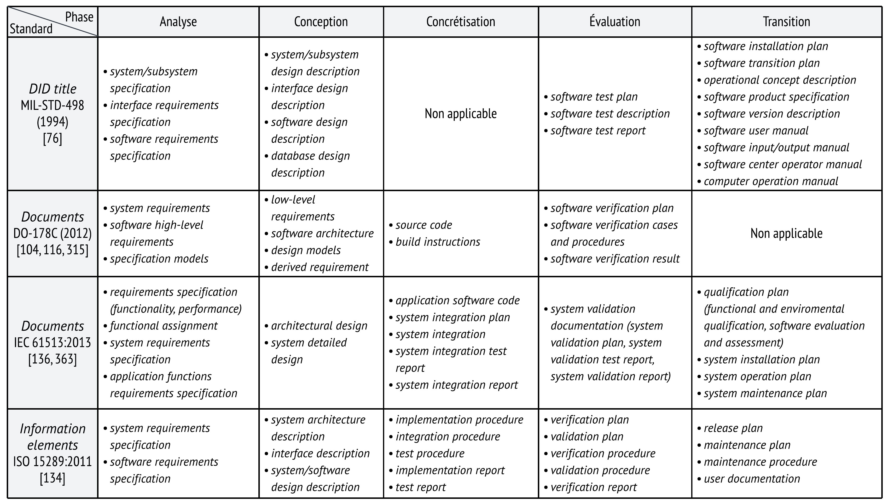
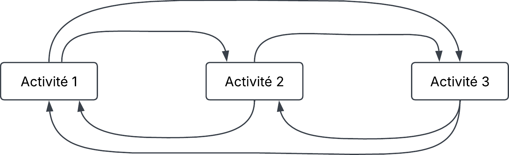
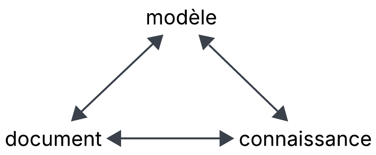
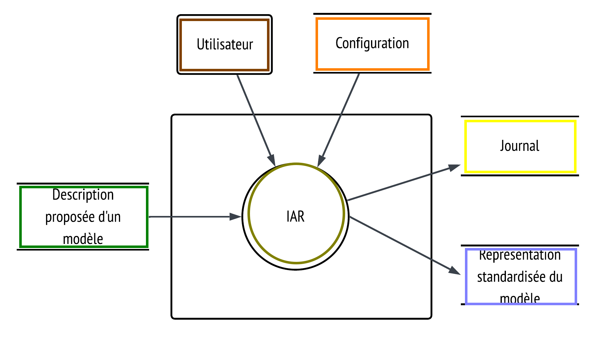
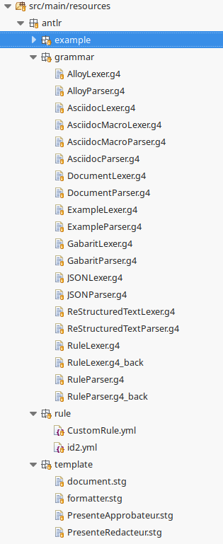
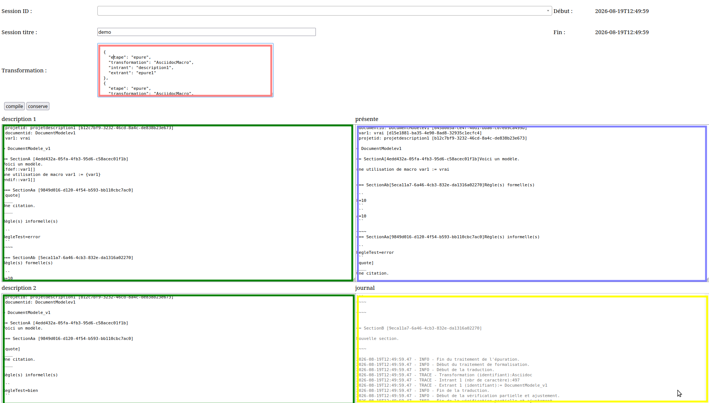

= Un instrument d'aide à la rédaction pour les documents exprimant des modèles logiciels.
:docinfo: shared
:toc: none
:customcss: custom.css
:source-highlighter: highlightjs
:revealjs_theme: white
:revealjs_slideNumber: c/t
:revealjs_controlsLayout: bottom-left
:revealjs_defaultTiming: 45
:revealjs_plugin_pdf: enabled
:revealjs_hash: true
:stem: latexmath
//Press s for presentation mode.

== Plan

. Le choix du sujet (pourquoi)
. L'importance des documents 
. La mauvaise qualité des documents (le problème)
. Récapitulatif théorique
. Récapitulatif du problème
. L'instrument développé (la solution)
. Évaluation de la solution (la qualité)
. Conclusion

[.notes]
--
. Pour faciliter le suivi et ainsi aider à la compréhension, je vous partage le plan de ma présentation.
. Entre parenthèse, il y a des compléments d'informations qui permettent de suivre la logique de cette présentation.
. Comme vous pouvez le voir, j'ai inséré dans ma présentation des récapitulatifs, j'espère que cela aidera.
--

== Le choix du sujet

D'abord, il y a :

[.medium-font]
* le désir d'obtenir des logiciels de plus grande qualité;
* les limites aux procédés de développement logiciel pour remplir cet objectif;
* les problèmes de qualité subsistants dans les documents;
* les répercussions engendrées par des documents de mauvaise qualité;
* la taille imposante du sujet qu'est la documentation informatique.

{empty} +

Ainsi, le problème est devenu celui de la formalisation et de la compréhension des documents servant aux modèles.

[.notes]
--
. J'essaie tant bien que mal de m'améliorer en tant que personne et à améliorer ce que je développe.
. Néanmoins, je me suis rendu compte que les procédés peuvent en échapper, et ce même lorsque le logiciel qui est construit est relativement simple.
. Il n'est pas rare de se retrouver avec une documentation incomplète ou incohérente. Ainsi, on se dit que cela a dû avoir un impact sur le logiciel.
. Je crois qu'il ne faut pas sous-estimé les impacts d'une mauvaise documentation, j'imagine que vous rappelez les écrasements d'avions chez Boeing, il y a quelques années et bien la mauvaise documentation a été pointée du doigt. (cela n'était pas le seul facteur).
. Ainsi, je me suis penché sur ce problème qui est celui d'une documentation de mauvaise qualité maintes fois abordée et toujours d'actualité.

--

== L'importance des documents

La documentation logicielle a pour fonction première de transmettre, au moyen de documents, des connaissances organisées
en modèles sur lesquels toute opérationnalisation d’un traitement informatique est fondée.

{empty} +

. l'informatique ne se limite pas au code source;
. les documents font partie du procédé de développement;
. les documents exprimant des modèles sont essentiels au développement.

[.notes]
--
. D'abords, je vous partage une des conclusions à laquelle, je suis arrivé lors de ma maitrise.
. Je vais tenter d'expliquer cette conclusion avec les trois énoncés suivants.
--

=== Un sommaire de plusieurs documents existants

[%autowidth, cols="a", frame=none, grid=none]
|===
^|
|===

[.notes]
--
. Voici un tableau que j'ai construit et qui montrant les différents types de documents qui doivent exister lors d'un procédé de développement logiciel, et ce selon différents standards.
. Les phases sont celles reliées aux procédés de développement
. Vous pouvez voir que le code source n'est qu'un document parmi tant d'autres. 
. DOD considère que c'est trivial et ne le spécifie pas. 
. DO-178C ne couvre pas la transition.
. Cela fait quelquefois déjà que j'utilise le terme procédé de développement, ainsi j'en profite pour donner des explications.
--

=== Explications sur le procédé

Définitions en français :
[%autowidth, cols="a", frame=none, grid=none]
|===
|
[.small-font]
* *procédé* : ensemble structuré d’activités visant un but logiquement interrelié par des antécédents et des conséquents où des intrants sont transformés en extrants;
* *processus* : instance d'un procédé;
* *artefact* : intrant tangible ou extrant tangible à un processus.
|===

Représentation de procédé sous la forme de diagramme :
[%autowidth, cols="a", frame=none, grid=none]
|===
^|
|===

Complément d'information sur le terme artefact en langage mathématique :
[.small-font]
[latexmath]
++++
artefact \in \{document, \text{entité informatique}, \dots\}
++++

[.small-font]
[latexmath]
++++
artefact \in \{intrant, extrant\}
++++

[.notes]
--
. Comme vous pouvez le constater ces explications utilisent différents langages et certaines explications laisse place à plusieurs interprétations.
. Par exemple, je n'ai pas expliqué la signification des éléments graphiques que sont les boîtes, les flèches pour le diagramme.
. Il faut garder à l'esprit que la maîtrise d'un langage peut aussi grandement varier d'une personne à l'autre.
. Ce qu'il faut retenir, c'est que le procédé suit une séquence, et ce dans un but. 
. Alors, quel est le but d'un procédé de développement ?
--

=== L'essentiel du procédé de développement

Lors de ce procédé, l'informatique appliquée va :

. chercher à définir, à s'approprier, à circonscrire et à caractériser les solutions acceptables pour un problème en particulier;
. réaliser et établir une entité informatique qui solutionne ce problème.

[.notes]
--
. (Lire)
. Parmi les intrants, les extrants ou les artefacts, on retrouvera un modèle du problème et un modèle de solution. 
. Cependant, ils peuvent se retrouver dispersés à travers les documents.
. Habituellement, en informatique le modèle de solution se retrouve dans la spécification des exigences logicielle (un type de document), mais il peut aussi bien se retrouve dans différents user stories (type).
--

=== Un exemple 

Exemple : calcul de la quantité de carburant

* Les documents comprennent : 
** besoin « Le système doit calculer la quantité de carburant nécessaire pour le restant du trajet. »;
** descriptions du domaine avec différentes formules de physique concernant la gravité, la distance, la combustion, etc.;
** exigences « Le calcul du carburant s'effectue comme X et les données prennent la forme d’Y. »;
* Un modèle du problème avec les concepts et les formules;  
* Un modèle de solution avec une représentation des données et des règles de calcul du carburant et du trajet;
* Un logiciel, c'est-à-dire le programme qui effectue le calcul.

[.notes]
--
. Voici un exemple très simple, il s'agit de faire un logiciel en mesure de calculer la quantité de carburant.
. Dans cet exemple, je décris sommairement le contenu du modèle de problème et du modèle de solution.
. Vous pouvez le voir que les informations se retrouvent dans les documents sous la forme de besoin, descriptions et exigences.
. Dans ce cas précis, la solution répond à un problème réel, mais en informatique la solution peut répondre à un problème technique comme une machine abstraite ou à un compilateur.
--

== La mauvaise qualité des documents

Il y a une mauvaise compréhension des objectifs et de l'usage :

* des langages formels;
* des artefacts dont les documents font partie.

{empty} +

Cela conduit à :

* une augmentation de l'usage de langage non formel;
* une utilisation de mesures et de critères subjectifs;
* une perception d'un manque de cohérence, de couverture et d’efficacité des artefacts produits;
* potentiellement des répercussions négatives sur les modèles et les connaissances.

[.notes]
--
. À l'origine de la mauvaise qualité se trouve vraisemblablement une mauvaise compréhension.
. Cette mauvaise compréhension à pour effet d'avoir des répercussions sur la qualité de la documentation et par conséquent du logiciel.
. Par exemple, l'usage de langage non formel ne permet pas l'usage de systèmes logiques et cela ne permet pas de trouver des incohérences.
. Tandis que confondre document, modèle et code source peut nuire de bien des façons comme à la compréhension.
. Néanmoins, cela nécessite davantage d'explications sur les relations et les langages.
--

=== Des relations

Ce qui est contenu dans les documents et les modèles a généralement un impact visible ou non immédiatement visible dans les logiciels produits.

{empty} +

[%autowidth, cols="a", frame=none, grid=none]
|===
^|
|
[.small-font]
* *modèle* : représentation d’un sujet pour en permettre le traitement;
* *modèle formel* : est composé d’un langage formel et d’un ensemble de règles et
vise la représentation d’un sujet pour en permettre le traitement;
|===

[.notes]
--
. Dès lors qu'il existe un problème avec des documents touchant à des modèles, il y a des répercussions sur les modèles et les connaissances.
. Il en va de même pour les connaissances et les modèles.
. L’informatique quant à elle utilise des modèles formels et des modèles pour traiter d’autres modèles.
. Par exemple, un procédé de développement est en lui-même un modèle dont le but est d'organiser et de structurer le développement.
. Si on désire de la qualité, on parlera d'un modèle de qualité à respecter. Ce type modèle définira les caractéristiques ou les critères à respecter.
. Les critères permettant de déterminer le respect ou non des caractéristiques.
--

=== La qualité 

Pour des documents, des modèles ou des logiciels, il est possible de retrouver ces caractéristiques de qualité :
[.medium-font]
[%autowidth, cols="a, a", frame=none, grid=none, options="header"]
|===
|type | caractéristique
|absolues | cohérence, couverture et efficacité
|relatives  | complétude, efficience et adaptabilité
|universelles  | réfutabilité et éthique
|===

[.notes]
--
. Mes lectures m'ont poussé à observer différents modèles de qualité pour les documents, les modèles et les logiciels. Ces modèles n'étaient pas identiques, mais partageaient plusieurs caractéristiques.
. Est-ce que cela vient du fait que l’on confond les trois ?
. Ce qui est certain est qu'il possible d'avoir des documents cohérents dès lors qu'ils expriment un modèle. 
--

=== La cohérence

[%autowidth, cols="a", frame=none, grid=none]
|===
|[.small-font]
* définition de *système logique* : est composé d’un langage formel et d’un ensemble de règles (axiome, proposition, logique) permettant d’inférer.
* définition de *cohérence* : système logique où aucune contradiction ne s’est encore manifestée.
|===

Les systèmes logiques permettent à un modèle formel ou système formel:

* de le rendre exécutable;
* d'y détecter des incohérences.

[.notes]
--
. Il s'agit du critère de qualité qui me semble le plus important pour la présentation. Il permettra d'expliquer la solution d'appliquer des systèmes logiques et des langages formels pour permettre de trouver des incohérences.
. Sans systèmes logiques impossibles pour une machine de calculer ou à un ordinateur d'exécuter un logiciel.
. Je tiens à rappeler quelques distinctions.
. La différence entre un système et un modèle est que le modèle vise un sujet.
. La différence entre un système formel et un système logique, ce sont les règles permettant d'inférer dans le système logique.
--

=== Les langages formels

Un langage formel comme le langage mathématique offrent :

. un ensemble de symboles précis;
. une syntaxe et une sémantique définies;
. une maîtrise largement partagée sur la planète.

{empty} +

Plusieurs langages formels en informatique ont les inconvénients suivants :

. de récupérer des symboles déjà existants;
. d'avoir une syntaxe peu intuitive;
. d'avoir une sémantique non définie;
. d'avoir une maîtrise peu répandue. 

[.notes]
--
. Est-ce que vous vous souvenez de mes explications sur un procédé ? 
. Cette explication peut aussi servir à illustrer que les langages ne sont pas tous équivalents.
. Lorsqu'un langage permet de diminuer les ambiguïtés, on parle alors de langages formels et le langage mathématique n'est pas le seul langage formel.
. Certains vont préconiser d'utiliser les langages formels à l'intérieur des certains documents du procédé de développement. Les méthodes formelles le font.
. Malheureusement en informatique, ce sont souvent les langages formels avec le plus d'inconvénients qui s'imposent largement.
--

=== Les langages non formels

La discipline qui traite ces langages est appelée *traitement automatique des langues*. Elle regroupe différentes techniques. Les grands modèles de langages sont un des résultats de ces techniques. Avec des inférences statistiques, elle offre des réponses satisfaisantes pour beaucoup d'utilisateurs.

{empty} +

Cependant, il y a des inconvénients :

. elle ne surmonte pas les ambiguïtés des langages non formels;
. la compréhension du fonctionnement interne de différentes techniques est très limitée;  
. la mise en place de certaines techniques nécessite énormément de ressources.

[.notes]
--
. Intuitivement, la documentation informatique devrait contenir des langages formels et non formels. 
. Cependant, la très grande majorité des documents sont écrits en langage non formel. 
. Néanmoins, le fichier de code source comprend des langages formels pour la raison que cela est nécessaire pour que l'ordinateur puisse en faire l'interprétation. 
--

== Récapitulatif théorique

Quelques constats :
[.medium-font]
* les documents exprimant des modèles sont nécessaires à la réalisation et l'établissement d'un logiciel pour modéliser/formaliser un problème et une solution;
* un logiciel concrétise un système formel ou un modèle formel;
* un système logique permet d'exécuter un système formel ou modèle formel et de trouver des incohérences;
* des documents erronés conduisent à des modèles erronés et des modèles erronés conduisent à des logiciels erronés.

[.notes]
--
. Nul doute de l'importance des documents exprimant des modèles.
--

== Récapitulatif du problème

Sommairement les attentes de la solution devraient :

. améliorer la compréhension des documents servant aux modèles;
. rendre le travail avec les modèles plus efficients;
. être utilisable, peu importe l'endroit, les gens ou les procédés.

{empty} +

Sommairement le besoin de la solution doit permettre de manipuler, d'adapter, de réutiliser et d'évaluer les modèles exprimés à travers des documents. Cela permettra d'obtenir des documents, des modèles et des logiciels de meilleure qualité.

[.notes]
--
. À des fins de compréhensions et pour sauver du temps, j'ai préféré résumer les attentes et les besoins qui ont été énoncés dans mon mémoire.
. L'analyse du problème dans sont ensemble a permis de choisir 5 attentes et 5 besoins. Cela a bien évidemment découlé de la revue de littérature qui s'y trouve.
. En passant, les attentes ont une forme subjectifs, ainsi ils ne permettent pas de confirmer leur respect avec la logique.
. Cela va demander entre autres des analyses qualitatives, sondages, etc.
--

== L'instrument développé

Sommairement, il permet  :

* de manipuler, d'adapter, de réutiliser et d'évaluer les modèles exprimés à travers des documents;
* de faciliter l'usage de langage formel;
* d'objectiver la qualité.

{empty} +

Deux groupes d'exigences :

* sur l'exploitation des modèles;
* sur l'exploitation des métamodèles. 

[.notes]
--
. Pour les mêmes raisons que les attentes et besoins, j'ai résumé les exigences.
. Des 5 besoins, 24 exigences ont été formulées. 
. Seulement, les 15 premières sont respectées par la preuve de concept.
. Les autres exigences permettra d'étendre la preuve de concept pour qu'elle soit en mesure de mieux traiter les métamodèles.
. Ainsi, je sépare les deux groupes d'exigences entre celles servant à l'exploitation des modèles et celles servant à l'exploitation des métamodèles. 
--

=== Explication sur le fonctionnement de l'IAR 

[.medium-font]
* descriptions formelles exprimant des métamodèles
ainsi que des règles (orange);
* documents définissant un modèle ou des changements à un modèle (vert);
* applique des transformations pour obtenir un modèle formel respectant
un système logique (or);
* documents produits à partir d’un modèle et selon des règles (bleu).

[%autowidth, cols="a", frame=none, grid=none]
|===
^|
|===

[.notes]
--
. J'ai détaillé la signification des boîtes les plus obscures.
. Pas d'inquiétude, je vais vous expliquer ce diagramme.
. L'instrument d'aide à la rédaction est le système nommé IAR dans le diagramme.
. Il prend en entrée différents documents exprimant un modèle. Ces documents peuvent utiliser des langages non formels ou formels.
. Cependant, l'IAR permet d'extraire le modèle des documents si les informations du modèle sont écrites en langages formels et possède des descriptions formelles de ces langages.
. Néanmoins, s'il y a du contenu en langage non formel, elle accompagnera le modèle, sans être vérifiée.
. Ainsi, l'instrument permettra d'éventuellement change le langage et de conserver une trace.
. (toute personne modifiant le modèle (brun);)
. (documents informant l’utilisateur du déroulement du processus (jaune);)
--

=== Définir ses langages formels

[frame=none, grid=none, cols="2a, 1a"]
|===
|
* l'instrument permet d'employer les descriptions formelles souhaitées pour appliquer les différentes transformations;
* une extension à la preuve de concept est celle d'être à même de développer ses descriptions à l'intérieur de l'instrument;
* les langages formels permis actuellement sont la forme Backus-Naur étendue (épuration et extraction), le langage StringTemplate (présentation), langage de l'instrument Easy-Rules (vérification) et le langage Alloy (règles formelles du modèle).
|

|===

[.notes]
--
. Pour le moment plusieurs des descriptions formelles se retrouvent dans les fichiers de configurations. 
. Éventuellement avec un instrument en mesure de traiter les métas modèles n'aura plus besoin de conserver cela dans la configuration.
. Extraction, vérification et règle formelles du modèle se retrouvent tous dans le processus de formalisation de l'instrument.
--

=== Interface utilisateur 

[frame=none, grid=none, cols="1a, 2a"]
|===
|
* sélectionner les transformations formelles (en rose);
* entrer les descriptions du modèle (en vert);
* observer une description standardisée du modèle (en mauve);
* observer le journal (en jaune).
|

|===

[.notes]
--
. Étant donné qu'une preuve de concept a été produite, je partage au minima une capture d'écran.
. L'interface utilisateur de la preuve de concept permet de déposer entre autres deux fichiers comprenant des descriptions du modèle, de mettre à jour le modèle et d'utiliser toutes les autres fonctions qui remplissent les exigences tenues par la preuve de concept.
. Je concède que cette dernière version d’interface utilisateur est très minimaliste. Mais, au moins elle permet de faire plusieurs vérifications.
--

== L'évaluation de la solution

Il y a :

. la vérification du respect des exigences avec des cas de tests;
. la validation des attentes envisagées avec des expérimentations.

[.notes]
--
. Certains critères de qualité se vérifient par la logique. 
. Tandis que d'autres nécessitent beaucoup plus d'effort par exemple en effectuant des analyses qualitatives, des sondages et, etc.
. Il a présenté un protocole expérimental pour arriver à évaluer les caractéristiques de qualité correspondant aux attentes. 
. Il s'agit d'une prochaine étape après le passage de la preuve de concept à un prototype.
--

=== La vérification

. il y a 5 cas de tests qui tentent de couvrir l'ensemble des 15 premières exigences;
. ces cas de tests sont implémentés puis exécutés;
. l'exécution permet de trouver des incohérences, de connaître l'efficacité et la couverture des exigences par l'implémentation.

[.notes]
--
. Ils sont écrits pour logiquement utiliser les 15 premières exigences.
. Effectivement l'exécution de ces montres l'efficacité de la preuve de concept et une couverture de l'implémentation à une hauteur 80%.
--

=== La validation 

. consiste en l'ébauche d'un protocole expérimental;
. vise à valider les critères de qualité que sont : la complétude, l'efficience et l'adaptabilité;
. il s'agit d'une prochaine étape à ce travail.

[.notes]
--
. Il y a la définition de la recherche, la collecte des données et
l’analyse des données.
. La mise en place de cette expérimentation n’a pas encore eu lieu, car elle nécessite d'abord un prototype découlant d’une preuve de concept.
--

== Conclusion ==

Cet instrument d'aide à la rédaction contribue à :

* donner un instrument pour contrôler les documents ;
* se familiariser avec le concept de modèle, incluant les langages formels et les règles ;
* se réapproprier la création de certains modèles, comme des grammaires et des métamodèles ;
* évaluer la façon et l’impact de mettre en place de bonnes pratiques. 

{empty} +

Cependant, la forme actuelle (preuve de concept) limite la validation possible de cette solution.

[.notes]
--
* Dans les prolongements possibles, il y a celui de l'étendre pour mieux manipuler les métamodèles.
* Il est possible aussi d'intégrer des instruments de traitement automatique des langues pour permettre de mieux évaluer ces techniques et de profiter de ce que les systèmes logiques peuvent offrir.
--

